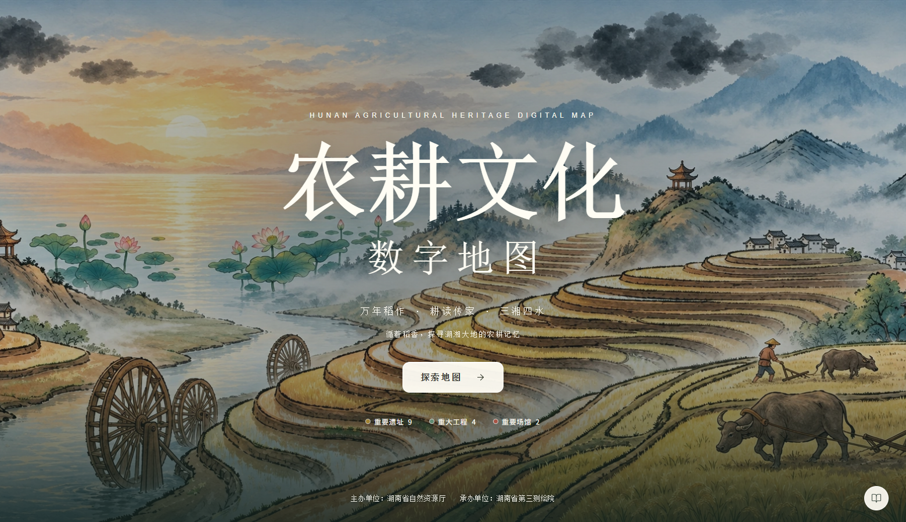

# CSZ2 欢迎页高清修复 · 2026-09-22

按用户提供的新截图，将米白风动稻田欢迎页替换为水墨农耕山水。以梯田、水车、耕牛、莲荷、村落与远山的构图为基础修复图像，去掉截图中的文字、按钮、图标和鼠标指针，再以独立网页元素呈现标题与入口。



## 素材与表现

- 实际修复图为1736×906像素，保留PNG原稿；网页采用同分辨率WebP，约500KB。
- 白色居中标题、浅色12px圆角入口；主短句仍为桌面17px、手机14px。
- 保留原介绍、点位数量与主承办信息；右下按钮打开介绍弹窗。
- 当前背景为静态插画，旧稻田画布与播放控制退出欢迎页。
- 版本仍为CSZ2；不移动原始 `csz2` 标签。旧36页PDF为此前版本的历史记录，本页单独补充最新修改。

## 核验

检查1560×900、1920×1080、1329×693、1024×768、390×844、320×640代表尺寸，图片加载正常、页面无横向溢出、页脚与正文不重叠。探索入口、介绍弹窗、键盘焦点正常。微信客户端未进行真机检查。

## 图像生成说明

使用内置 image_gen 图像编辑工具，以用户截图为编辑目标。工具实际输出为1736×906；提示中请求更高分辨率属于生成目标，不代表实际输出尺寸。网页端的WebP仅作同分辨率格式压缩。

最终使用的提示词：

```text
Use case: precise-object-edit. Asset type: high-resolution full-bleed website welcome background, landscape, approximately 1.92:1. Input Image 1 is the EDIT TARGET, not just a style reference. Restore and enhance this exact Chinese ink-and-watercolor agrarian landscape from a compressed screenshot. Produce the highest available resolution, ideally 3840 x 2000. Preserve its composition and subject placement faithfully: warm sunrise and pale gold water on the left; layered blue-grey misty mountains and brush-painted dark cloud clusters in the upper half; lotus flowers and broad green leaves at left-middle; winding gold and ochre rice terraces sweeping from lower left across the center to the upper right; traditional pavilions and small Chinese rural houses; wooden waterwheels at the lower left; farmers and water buffalo ploughing on the right foreground. Restore clean elegant dark ink outlines, crisp waterwheel spokes, terrace edges, tiled roofs and natural details. Preserve the muted blue-grey, straw-gold and sage palette and handmade watercolor/ink illustration style, soft atmospheric mist; not photorealistic, not saturated cartoon. REMOVE ALL website overlays: the large white Chinese title, subtitle, tiny English and Chinese copy, button, category dots, bottom-right white round icon, mouse cursor, and any screenshot frame. Seamlessly reconstruct the landscape underneath those overlays. No text of any kind, no letters, logos, watermarks, buttons or user interface in the output. Do not add new decorative subjects or change the scene. This is a clean background plate; real accessible title and controls will be added later in HTML.
```
